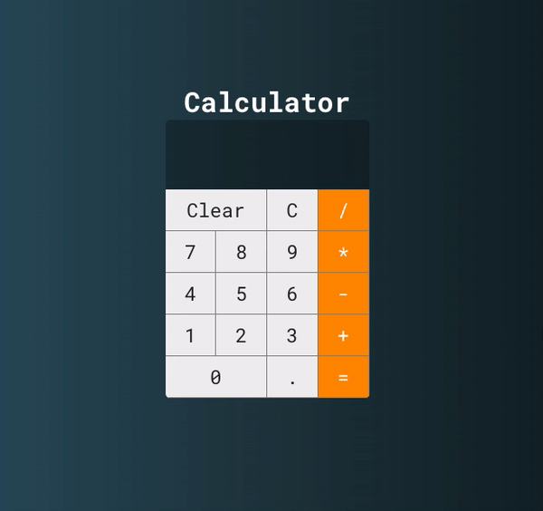

  

 

# Calculator 💻

Projeto calculadora simples com ReactJS.

## 🚀 Tecnologias

Esse projeto foi desenvolvido utilizando as seguintes tecnologias:

- [React](https://reactjs.org)

## 🚀 Instalação e execução

1. Faça um clone desse repositório;
2. Entre na pasta rodando `cd calculator`;
3. Rode `yarn` para instalar as dependências;
4. Rode `yarn start` para rodar o projeto.

## License

Esse projeto está sob a licença MIT.

